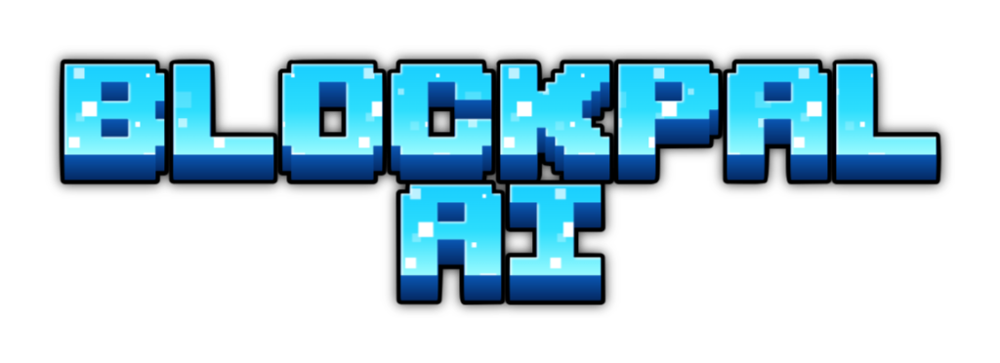
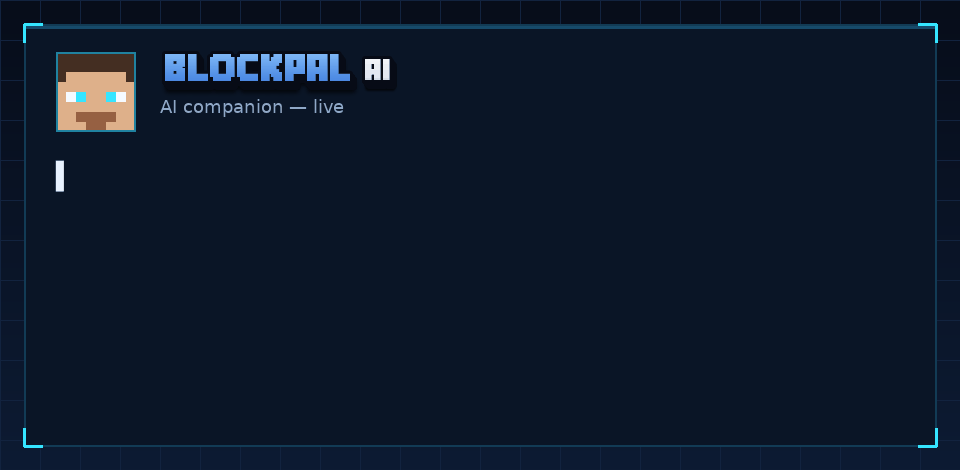
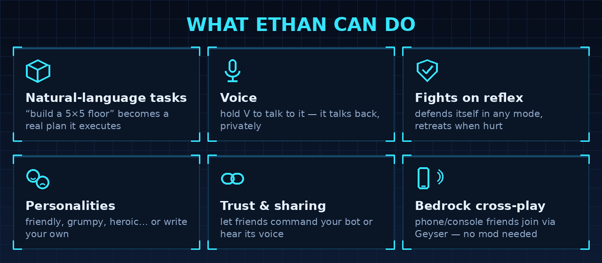
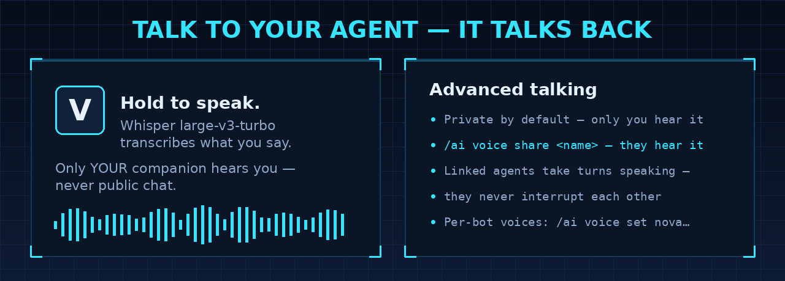

# Blockpal AI

**A friendly AI companion for Minecraft (Fabric) that builds, fights, talks, and thinks.**

Blockpal drops a player-like character named Ethan into your world. Give it a goal in
plain language — in chat, with a command, or just by speaking into your microphone — and
it plans the steps through a large language model and then carries them out: building,
mining, gathering, fighting, and running commands. It defends itself on reflex, manages
its own gear, talks back in its own voice (out loud, if you like), and is configured
entirely from in-game screens. It works in singleplayer and multiplayer, and your
Bedrock-edition friends can play with it too.

Blockpal connects to any OpenAI-compatible API (Hugging Face, OpenAI, Ollama, LM Studio,
and others), so you choose the model and supply the key — and with no key at all it
falls back to a free built-in AI, so it works straight out of the box.

## Features

- **Natural-language task planning.** Tell it what you want — "build a 5x5 floor", "clear these trees", "guard this spot" — and it turns that into a multi-step plan it actually performs.
- **Talks back.** It listens to chat and replies in the first person. Common orders like come, follow, stay, and stop are handled instantly with no API call.
- **Voice.** Hold **V** and speak to your companion — Whisper large-v3-turbo transcribes you, and only your own bot hears it. It answers out loud with a text-to-speech voice you can pick per bot; share its voice with friends, and shared ("linked") agents take turns speaking so they never interrupt each other.
- **Personalities.** Choose how it talks and acts — friendly, cheerful, grumpy, stoic, heroic, or shy — or write your own custom personality, which the AI checks to keep family-friendly.
- **Fights on reflex.** It always watches for threats, defends itself in any mode, and retreats when its health gets low.
- **Manages its own gear.** It picks up dropped items, equips the best weapon and armor it finds, eats food when hurt, and throws away harmful items.
- **Per-bot management and trust.** Own several companions and set each one up differently. Let specific friends command a chosen bot through a per-bot trust list, while renames, dismissals, and trust changes stay owner-only.
- **Play from Bedrock.** Friends on iPad, console, or phone can join through a Geyser proxy and play with Ethan — with no mod on the Bedrock device.
- **One-click hosting.** From the pause menu, or with /aihost, a Java player can download and launch a Bedrock-ready server (Minecraft plus Fabric plus the latest Geyser and Floodgate) and share the connect address, so friends on either edition can join.
- **In-game settings and admin panels.** Tabbed screens for settings, admin controls, and your personal preferences — no config-file editing required.
- **Bring your own key and model.** Per-player API keys and a server-curated model list, so one server owner is not billed for everyone.
- **Safety rails.** A task watchdog, a server-wide bot cap, command permission limits, and an emergency frame-rate kill switch that pauses bots if performance collapses.

## Requirements

- Minecraft (Java Edition) 26.2
- Fabric Loader 0.19.3 or newer, plus Fabric API
- An OpenAI-compatible API key for the AI features (a free Hugging Face token works)

## Getting started

1. Download the latest Blockpal jar and put it in your mods folder, next to Fabric API.
2. Launch Minecraft on the matching Fabric version.
3. In game, run /ai summon to meet Ethan.
4. Give it an AI key with /ai mykey followed by your token, or, as a server admin, set a shared key in the settings panel.
5. Try a task, for example /ai build a 5x5 floor, or just type "Ethan, follow me" in chat.

Full setup and configuration details are in the wiki, linked below.

## Play from Bedrock (iPad, console, phone)

Blockpal is mostly server-side, so friends on Minecraft Bedrock Edition can join a Java
server through a Geyser proxy and play with Ethan — summon it, talk to it, and give it
tasks from chat and commands, with no mod on the Bedrock device. On the server, add
Geyser-Fabric and Floodgate-Fabric to the mods folder; Blockpal treats Floodgate as
optional, so the server still runs fine without it.

If you do not already have a server, a Java player can host one in a couple of clicks.
From the pause menu choose "Host with Blockpal", or run /aihost: it downloads Minecraft,
Fabric, and the latest Geyser and Floodgate from their official sources, launches a
server, and shows the Java and Bedrock connect addresses. Only Java can host; Bedrock
players join. The address shown is your own computer's, and friends on the internet still
need a forwarded port, so share it only with people you trust.

The visual menus and the frame-rate watchdog are Java-client features, so Bedrock players
get text and command fallbacks instead. One rough edge: Geyser has no general
custom-entity support, so Ethan's appearance may render oddly on Bedrock even though it
works fully.

## Talk to it — voice

Hold **V** (rebindable) and say what you want. Your words are transcribed with Whisper
large-v3-turbo and go straight to your own companion — never public chat. Its replies
are spoken aloud, privately: only you hear your agent unless you `/ai voice share` with
a friend, and shared agents take turns speaking instead of interrupting each other.
Details in the wiki's Voice page, linked below.

## Common commands

A few to start with; the full list is in the wiki.

- `/ai summon [name]` — spawn a companion
- `/ai come`, `/ai follow`, `/ai stay`, `/ai stop` — basic orders
- `/ai <task>` — give a natural-language task
- `/ai voice` — voice status; hold **V** to talk to it; `/ai voice share <player>` to share
- `/ai personality [id]` — change how it talks and acts
- `/ai trust <player>` — let a friend command your bot
- `/ai panel` — open the settings and admin screens
- `/ai mykey <token>` — set your personal AI key
- `/aihost` — host a Bedrock-ready server (Java client only)

## Documentation

Full documentation lives in the wiki:

- Installation: https://github.com/MilkdromedaStudios/Blockpal-AI/wiki/Installation
- Getting Started: https://github.com/MilkdromedaStudios/Blockpal-AI/wiki/Getting-Started
- Commands: https://github.com/MilkdromedaStudios/Blockpal-AI/wiki/Commands
- Talking to Your Assistant: https://github.com/MilkdromedaStudios/Blockpal-AI/wiki/Talking-to-Your-Assistant
- Voice: https://github.com/MilkdromedaStudios/Blockpal-AI/wiki/Voice
- Settings: https://github.com/MilkdromedaStudios/Blockpal-AI/wiki/Settings
- Personalities: https://github.com/MilkdromedaStudios/Blockpal-AI/wiki/Personalities
- Trust and Per-Bot Management: https://github.com/MilkdromedaStudios/Blockpal-AI/wiki/Trust-and-Per-Bot
- Bedrock (Geyser) and one-click hosting: https://github.com/MilkdromedaStudios/Blockpal-AI/wiki/Geyser-Bedrock
- Building From Source: https://github.com/MilkdromedaStudios/Blockpal-AI/wiki/Building-From-Source
- Troubleshooting: https://github.com/MilkdromedaStudios/Blockpal-AI/wiki/Troubleshooting

## License

Blockpal is released under the MIT License. See the LICENSE file for details.
