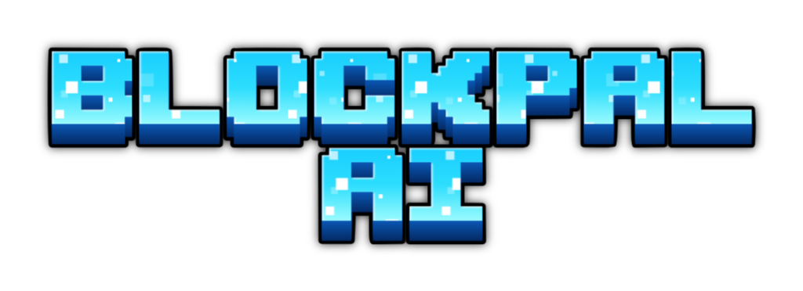
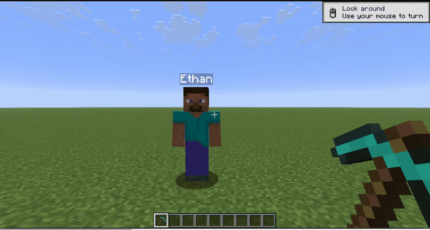
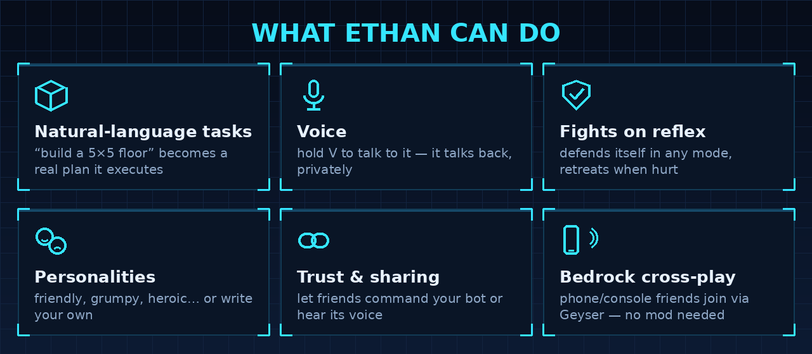
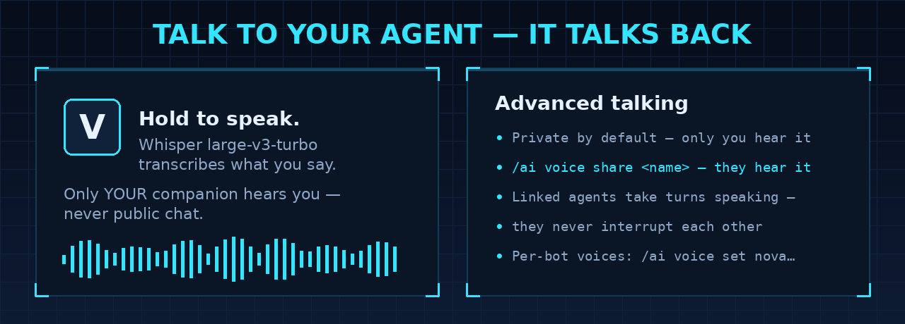

**A friendly AI companion for Minecraft (Fabric) that builds, fights, talks, and thinks.**

Blockpal drops a player-like character named Ethan into your world. Give it a goal in
plain language — in chat, with a command, or just by speaking into your microphone — and
it goes and does it: building, mining, gathering, fighting, using chests. It defends
itself on reflex, manages its own gear, talks back in its own voice (out loud, if you
like), and is configured entirely from in-game screens. It works in singleplayer and
multiplayer, and your Bedrock-edition friends can play with it too.

**The easiest way to give it a brain: connect the AI you already pay for.** Blockpal runs
an MCP server, so Claude, ChatGPT, Grok or Gemini can connect straight to your world —
no API key stored in the game. Run `/ai mcp` in game and it shows you the address, your
token and the exact config to paste. It also still speaks to any OpenAI-compatible API
directly (Hugging Face, OpenAI, Ollama, LM Studio), runs on a local model with no internet
at all, or works with no key whatsoever on a free built-in AI.

**It plays like a player, not like an admin.** Ethan looks at the world — it gets an
actual rendered picture of what its eyes can see — decides what to do, and writes a short
script that presses its own movement keys and mouse buttons. It mines at the speed its
tool allows, reaches about as far as you do, opens chests it's standing next to, and
never teleports. That makes it a little dumber than a bot that conjures blocks into place.
That's the point.

## Features

- **Connect your own AI over MCP.** Point Claude, ChatGPT, Grok or Gemini at your world and let it drive the companion — no key stored in the game, and you watch it think in the app's own window. `/ai mcp` shows the address, the token and a per-app setup guide.
- **One AI connection, never two.** Pick exactly one — MCP, your own key, Player2, a local Ollama, the free service, or none. No more guessing which provider answered, or which one is being billed.
- **It looks, then writes code.** The companion sees a picture rendered from its own eyes, decides, and writes a little script that presses its keys and mouse buttons. Everything it manages, a player could have managed.
- **It uses chests.** Chests, double chests, barrels, shulker boxes, hoppers and furnaces — opened within arm's reach, a stack at a time, with ore and fuel going into the right furnace slots by themselves.
- **It never teleports.** Companions walk, swim and climb after you like something that actually lives in the world. (You get a warning the first time you go creative, since you can out-fly one in seconds.)
- **It lives on its own.** With no AI connected at all it still eats when hurt, swims up when drowning, gets out of fires, unsticks itself, and makes its own way back to you.
- **Natural-language task planning.** Tell it what you want — "build a 5x5 floor", "clear these trees", "guard this spot" — and it goes and does it.
- **Talks back.** It listens to chat and replies in the first person. Common orders like come, follow, stay, and stop are handled instantly with no API call.
- **Voice.** Hold **V** and speak to your companion — Whisper large-v3-turbo transcribes you, and only your own bot hears it. It answers out loud with a text-to-speech voice you can pick per bot; share its voice with friends, and shared ("linked") agents take turns speaking so they never interrupt each other.
- **Personalities.** Choose how it talks and acts — friendly, cheerful, grumpy, stoic, heroic, or shy — or write your own custom personality, which the AI checks to keep family-friendly.
- **Fights on reflex.** It always watches for threats, defends itself in any mode, and retreats when its health gets low.
- **Manages its own gear.** It picks up dropped items, equips the best weapon and armor it finds, eats food when hurt, and throws away harmful items.
- **Per-bot management and trust.** Own several companions and set each one up differently. Let specific friends command a chosen bot through a per-bot trust list, while renames, dismissals, and trust changes stay owner-only.
- **Play from Bedrock.** Friends on iPad, console, or phone can join through a Geyser proxy and play with Ethan — with no mod on the Bedrock device.
- **One-click hosting.** From the pause menu, or with /aihost, a Java player can download and launch a Bedrock-ready server (Minecraft plus Fabric plus the latest Geyser and Floodgate) and share the connect address, so friends on either edition can join.
- **In-game settings and admin panels.** Tabbed screens for settings, admin controls, and your personal preferences — no config-file editing required.
- **Bring your own key and model.** Per-player API keys and a server-curated model list, so one server owner is not billed for everyone.
- **Safety rails.** A task watchdog, a server-wide bot cap, command permission limits, and an emergency frame-rate kill switch that pauses bots if performance collapses.

## Requirements

- Minecraft (Java Edition) 26.2
- Fabric Loader 0.19.3 or newer, plus Fabric API
- An AI to think with — any one of: an AI app you already have (Claude, ChatGPT, Grok, Gemini) connected over MCP, an OpenAI-compatible API key (a free Hugging Face token works), a local Ollama, or the free built-in service

## Getting started

1. Download the latest Blockpal jar and put it in your mods folder, next to Fabric API.
2. Launch Minecraft on the matching Fabric version.
3. In game, run /ai summon to meet Ethan.
4. Give it a brain. Easiest: run /ai connection set mcp then /ai mcp, and follow the guide to point Claude, ChatGPT, Grok or Gemini at your world. Or set an API key with /ai mykey followed by your token.
5. Try a task, for example /ai build a 5x5 floor, or just type "Ethan, follow me" in chat.
6. Curious what it can see? /ai look reads out its actual field of view.

Full setup and configuration details are in the wiki, linked below.

## Play from Bedrock (iPad, console, phone)

Blockpal is mostly server-side, so friends on Minecraft Bedrock Edition can join a Java
server through a Geyser proxy and play with Ethan — summon it, talk to it, and give it
tasks from chat and commands, with no mod on the Bedrock device. On the server, add
Geyser-Fabric and Floodgate-Fabric to the mods folder; Blockpal treats Floodgate as
optional, so the server still runs fine without it.

If you do not already have a server, a Java player can host one in a couple of clicks.
From the pause menu choose "Host with Blockpal", or run /aihost: it downloads Minecraft,
Fabric, and the latest Geyser and Floodgate from their official sources, launches a
server, and shows the Java and Bedrock connect addresses. Only Java can host; Bedrock
players join. The address shown is your own computer's, and friends on the internet still
need a forwarded port, so share it only with people you trust.

The visual menus and the frame-rate watchdog are Java-client features, so Bedrock players
get text and command fallbacks instead. One rough edge: Geyser has no general
custom-entity support, so Ethan's appearance may render oddly on Bedrock even though it
works fully.

## Talk to it — voice

Hold **V** (rebindable) and say what you want. Your words are transcribed with Whisper
large-v3-turbo and go straight to your own companion — never public chat. Its replies
are spoken aloud, privately: only you hear your agent unless you `/ai voice share` with
a friend, and shared agents take turns speaking instead of interrupting each other.
Details in the wiki's Voice page, linked below.

## Common commands

A few to start with; the full list is in the wiki.

- `/ai summon [name]` — spawn a companion
- `/ai mcp` — connect Claude, ChatGPT, Grok or Gemini to your world
- `/ai connection` — see (or switch) the one AI connection in use
- `/ai look` — read what your companion can actually see
- `/ai come`, `/ai follow`, `/ai stay`, `/ai stop` — basic orders
- `/ai <task>` — give a natural-language task
- `/ai voice` — voice status; hold **V** to talk to it; `/ai voice share <player>` to share
- `/ai personality [id]` — change how it talks and acts
- `/ai trust <player>` — let a friend command your bot
- `/ai panel` — open the settings and admin screens
- `/ai mykey <token>` — set your personal AI key
- `/aihost` — host a Bedrock-ready server (Java client only)

## Documentation

Everything you need is in the **[Blockpal Wiki](https://github.com/MilkdromedaStudios/Blockpal-AI/wiki)**:

- 🧠 [Connect Claude, ChatGPT, Grok, or Gemini](https://github.com/MilkdromedaStudios/Blockpal-AI/wiki/MCP-Server)
- 👁️ [How Blockpal sees and thinks](https://github.com/MilkdromedaStudios/Blockpal-AI/wiki/Vision-and-Code)
- 📦 [Installation guide](https://github.com/MilkdromedaStudios/Blockpal-AI/wiki/Installation)
- 🚀 [Getting started](https://github.com/MilkdromedaStudios/Blockpal-AI/wiki/Getting-Started)
- ⌨️ [Commands](https://github.com/MilkdromedaStudios/Blockpal-AI/wiki/Commands)
- 💬 [Talking to your assistant](https://github.com/MilkdromedaStudios/Blockpal-AI/wiki/Talking-to-Your-Assistant)
- 🎙️ [Voice setup](https://github.com/MilkdromedaStudios/Blockpal-AI/wiki/Voice)
- ⚙️ [Settings](https://github.com/MilkdromedaStudios/Blockpal-AI/wiki/Settings)
- 🎭 [Personalities](https://github.com/MilkdromedaStudios/Blockpal-AI/wiki/Personalities)
- 🤝 [Trust and bot management](https://github.com/MilkdromedaStudios/Blockpal-AI/wiki/Trust-and-Per-Bot)
- 🎮 [Bedrock + one-click hosting](https://github.com/MilkdromedaStudios/Blockpal-AI/wiki/Geyser-Bedrock)
- 🛠️ [Troubleshooting](https://github.com/MilkdromedaStudios/Blockpal-AI/wiki/Troubleshooting)
